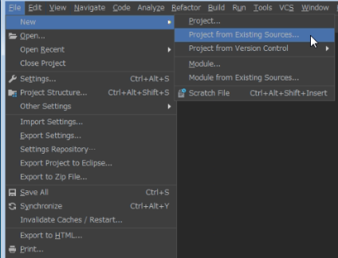
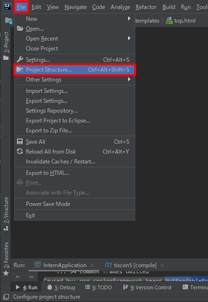
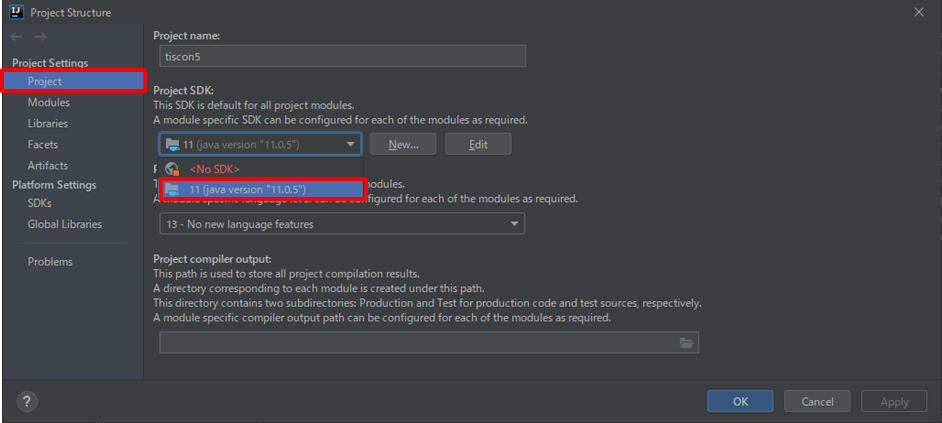
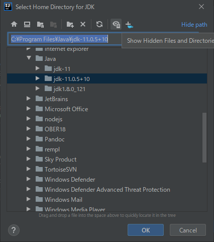

# QA一覧

***
* [IntelliJでのプロジェクトのcloneができない](#intellijでのプロジェクトのcloneができない)
* [IntelliJのフォルダ表示と実際のフォルダ表示が違う](#intellijのフォルダ表示と実際の内容が違う)
* [動作確認していると ClassCastException が出る](#動作確認していると-classcastexception-が出る)

***

### JDKの環境変数設定
1. システム環境変数『Path』 (例) `C:\Program Files\Java\jdk-11\bin`
1. システム環境変数『JAVA_HOME』 (例) `C:\Program Files\Java\jdk-11`

> **【補足】**
> * ユーザー環境変数とシステム環境変数の両方に同じ変数名で値が設定されている場合、ユーザー環境変数の値が優先されてしまいます。ユーザー環境変数に『JAVA_HOME』が存在する場合、そちらは削除してください。
> * 環境変数『Path』だけはユーザー変数がシステム変数を上書きせず、両方の値が「;」で連結された設定となります。

## IntelliJでのプロジェクトのcloneができない
下記の問題である可能性があります。確認してみてください。

### URLの入力誤り
Git Repository URLに入力しているURLが正しいかを確認してください。
入力するURLは `https://github.com/tiscon/tiscon5.git` です。

### Gitインストールが完了していない
コマンドプロンプトで `git --version` と入力し、gitのバージョン情報が表示されるか確認してください。
表示されない場合、Gitのインストールに失敗しています。Gitのインストールを行ってください。

## IntelliJのフォルダ表示と実際の内容が違う
cloneが成功すると、 [tiscon5のトップページ](https://github.com/tiscon/tiscon5) に表示されるのと同じ、フォルダとファイルが手に入ります。

しかしIntelliJに表示される内容がそれに沿わないことがあります。その時は以下を順番に確認してください。

### エクスプローラー(またはFinder)で該当のフォルダを表示した時、中身が入っているか？
入っていなければcloneに失敗しています。フォルダを消して、再度cloneしてみましょう。

### フォルダを表示すると中身が入っているのにIntelliJでは見られない
IntelliJがフォルダを読み込むのに失敗しています。再度読み込みましょう。

IntelliJの `File` > `New` > `Project from Existing Sources` を選択して、エクスプローラー(またはFinder)で確認したフォルダを開いて `Open` をクリックします。

表示される手順に従って進みます。`Project File already exists` と言われたら、上書きを選びましょう。
プロジェクトが開いたら、IntelliJがフォルダを読み込むのを待ってから再度フォルダ構成を確認してください。

## 動作確認していると ClassCastException が出る
tiscon5が使っている別プログラムが読み込めていないかもしれません。プログラムをリフレッシュしましょう。

1. IntelliJを開いてください。
1. Shiftキーを2回クリックすると、検索窓が表示されます。そこに「reimport all maven projects」と入力すると、そのような選択肢が出るのでそれを選択してください。 

1. IntelliJ の画面右下に「Resolving Maven Dependencies...」というようなメッセージと一緒に進行度合いを示すバーが表示されるので、それが消えるまで待ってください。
1. これでプログラムの再読込ができました。再度動作確認をしてみてください。

## JDKが設定されていない
IntelliJで「Project JDK is not specified」と出ている場合、JDKの設定がされていません。
[File] → [Project Structure]をクリックしてProject Structureを開いてください。

Project SDKが<No SDK>になっていたら、今回のインストールしたJavaのversionに合わせて変更をしてください。

なお、プルダウンで選択したいversionが出てこない場合は[New...]より、今回インストールしたJavaのディレクトリを選択してください。

### 解決しない場合
スタッフに問い合わせてください。その際、

* 環境構築の各手順の「インストールできたら」のステップの実行結果を、スクリーンショットもしくはテキストとしてコピペして教えてください。
* スクリーンショットは、IntelliJの画面に表示されたメッセージが見えるように撮影してください。
* テキストファイルは、IntelliJのMaven Projectsメニューで「clean」、「compile」を実行し、表示されたすべてのメッセージをコピーして貼り付けてください。