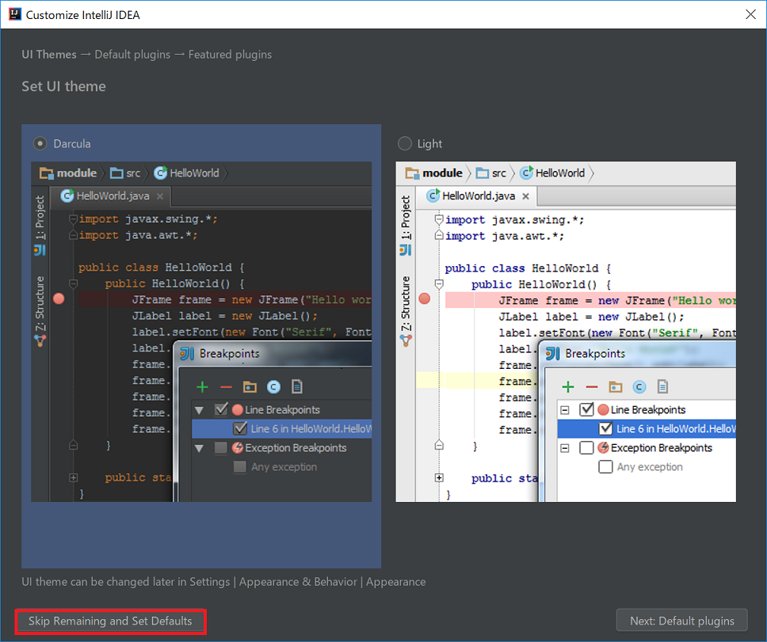
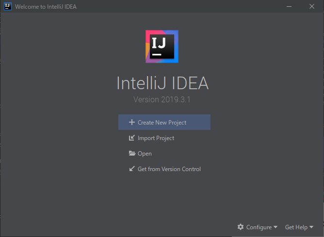
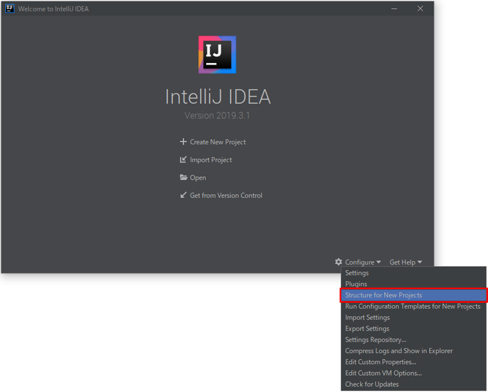
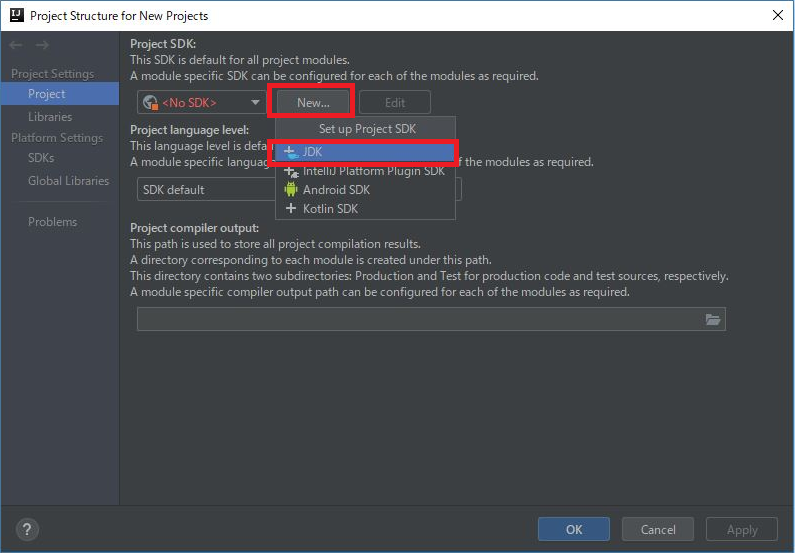
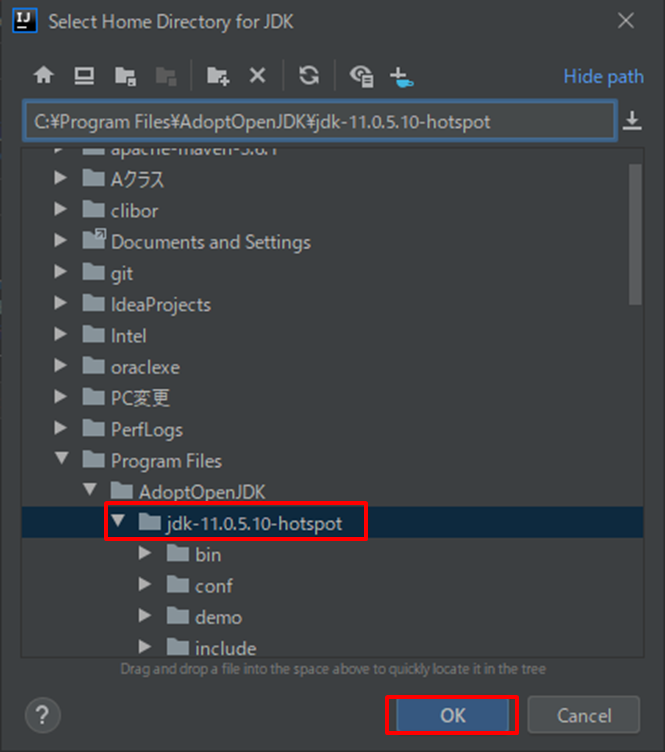
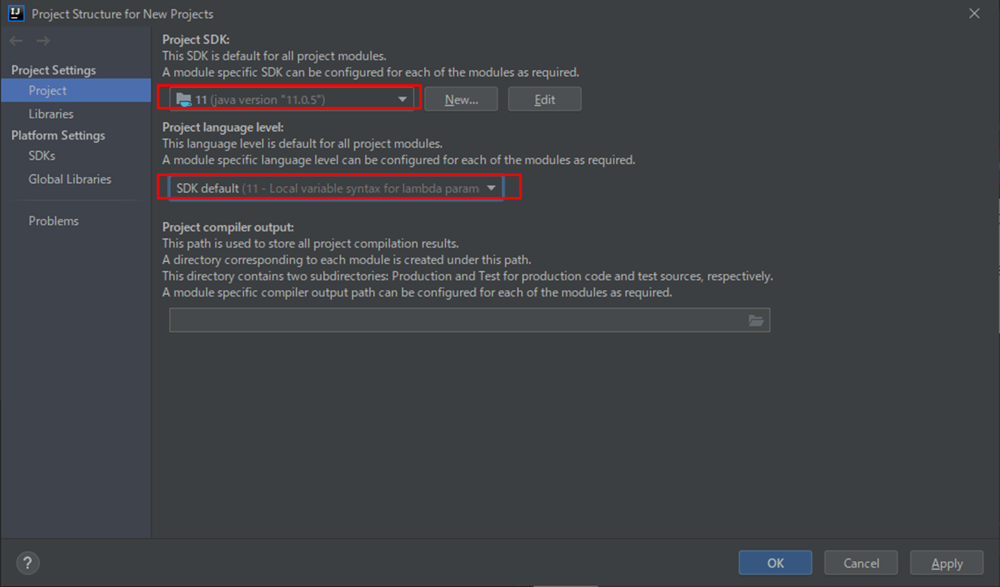

# IntelliJのインストール

## 前提条件(Windows)

* [コマンドプロンプトを起動](tipsForWin.md#コマンドプロンプトの起動方法)して `java -version` とコマンドを入力した時、結果が返ってきますか？

## 前提条件(Mac)

* [Terminalを起動](tipsForMac.md#terminalの起動方法)して `java -version` とコマンドを入力した時、結果が返ってきますか？

## インストール

1. https://www.jetbrains.com/idea/#chooseYourEdition のDOWNLOADボタンから、Lisenceが **Open-source, Apache 2.0** となっているものをダウンロードしてください。
1. ダウンロードできたインストーラーを起動して、表示される手順に従ってインストールを進めてください。  
よくわからない項目は変更せずに進めて構いません(Next, OK, Install 等)。

## IntelliJの初回実行

インストールするとデスクトップにショートカットが作成されますので起動してください。 
ショートカットが無い場合、スタートメニューのプログラム一覧から起動してください。 
 `JetBrains` > `IntelliJ IDEA Community Edition

起動中は下記のような画面が表示されます。 

下記の画面が表示されたら[Skip Remaining and Set Defaults]を選択してください。 

起動が完了すると下記のような画面が表示されます。 

## SDKの設定

1. Welcome画面で[Configure]→[Structure for New Projects]と選択してください。 

1. [Project SDK]という見出しの下にあるプルダウンが＜No SDK＞になっていると思いますので、【New...】→【JDK】を選択してください。 
なお、＜No SDK＞とある箇所のプルダウンにすでに【11(java version "11.0.5")】がある場合はそれを選択してください。

1. （【11(java version "11.0.5")】を選択した場合はこの手順は不要です。）
ご自身がインストールしたjdkの場所(C:\Program Files\AdoptOpenJDK\jdk-11.0.5.10-hotspot)を選択して[OK]を押下してください。 

1. Project SDKが設定され、【11(java version "11.0.5")】が選択されるかと思います。
一つ下の項目「Project language level」は「SDK default」を選択し、[OK]を押下してください。 

