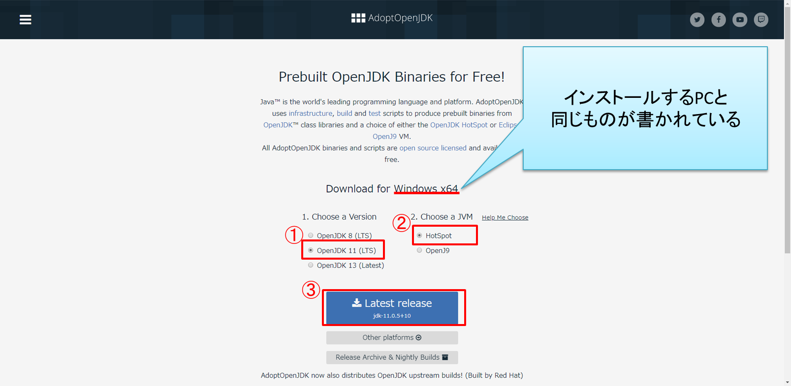
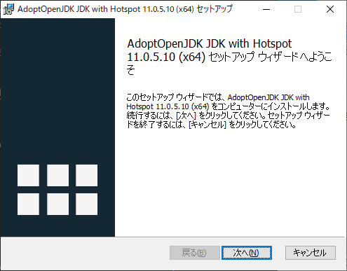
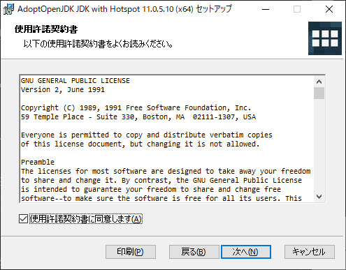
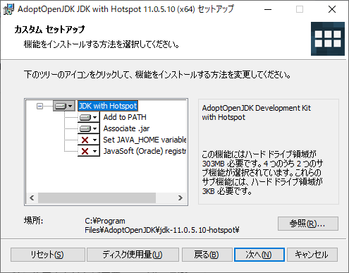
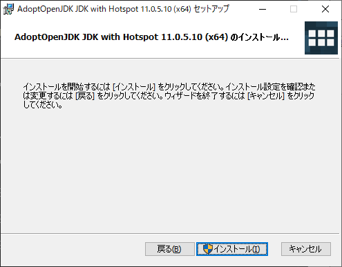

# Javaのインストール(Windows)

## 前提条件

* [自分のPCのOSが何bitか知っていますか？](preparationForWin.md#自分のpcのbit数を知っておく)
* [ファイルの拡張子が表示されていますか？](preparationForWin.md#ファイルの拡張子表示)

## インストール

**JDK11のインストール**及び**環境変数の設定**を行います。

> **注意点**
> * コマンドプロンプトの開き方が分からない方は、[コマンドプロンプトの起動方法 | Windowsマシンの開発TIPS](tipsForWin.md#コマンドプロンプトの起動方法)を読んでみてください。

### 1. JDK11をダウンロード

以下のサイトにアクセスして、AdoptOpenJDKのJDK11をダウンロードしましょう。

[AdoptOpenJDK](https://adoptopenjdk.net/index.html)

サイトを開くと以下のような画面が開きます。
画像のように、
①OpenJDK 11を選択し、
②HotSpotを選択し、
③Latest releaseをクリックしてください。
なお、「Download for ...」でご自身のPCと異なるものが表示されている場合は[ご連絡](whenYouAreStuck.md)をお願いします。
Windows 32bitであれば「Windows x86」、Windows 64bitであれば「Windows x64」といったように表示されるはずです。



なお、2020/01/08現在はOpenJDK 11の最新版は**11.0.5+10**となっているため、以降の手順はこのversionで進めます。
ダウンロード時にさらに新しいversionのものが選択される可能性がありますが、その場合はそのversionで進めて構いません。

### 2. JDKをPCにインストールする。
ダウンロードしてきたファイルをダブルクリックで実行してください。
実行すると以下のような画面が開きます。
特に設定は変更せず、[次へ]をクリックしていきます。







[インストール]をクリックするとインストールが開始します。



[完了]を押して終了です。


## インストールできたら

[コマンドプロンプトを起動](tipsForWin.md#コマンドプロンプトの起動方法)して、

```sh
(Windows が 64bitの場合)
C:\Users\yourUserName> java -version
openjdk 11.0.5 2019-10-15
OpenJDK Runtime Environment AdoptOpenJDK (build 11.0.5+10)
OpenJDK 64-Bit Server VM AdoptOpenJDK (build 11.0.5+10, mixed mode)
```
というように `java` コマンドが動くことが確認できればOKです。

またこの時、`java -version`で表示されたバージョンが、自分がインストールしたJavaのバージョンと一致していることを確認してください。
