# 自分のPCでアプリを動かす

## 前提条件(Windows)

* [コマンドプロンプトを起動](tipsForWin.md#コマンドプロンプトの起動方法)して `java -version` とコマンドを入力した時、結果が返ってきますか？
* [コマンドプロンプトを起動](tipsForWin.md#コマンドプロンプトの起動方法)して `git --version` とコマンドを入力した時、結果が返ってきますか？

## 前提条件(Mac)

* [Terminalを起動](tipsForMac.md#terminalの起動方法)して `java -version` とコマンドを入力した時、結果が返ってきますか？
* [Terminalを起動](tipsForMac.md#terminalの起動方法)して `git --version` とコマンドを入力した時、結果が返ってきますか？

## 手順
1. IntelliJでプロジェクトをcloneする
2. ソースコード確認
3. Gitの設定
4. Webアプリケーションの起動確認

### 1. IntelliJでプロジェクトをcloneする

1. IntelliJを起動し、 `Get from Version Control` を選択します。
1. URLに `https://github.com/tiscon/tiscon5.git` を入力します。<br>
Directoryには自動で`C:\Users\[ユーザ名]\IdeaProjects\tiscon5`が設定されます。<br>
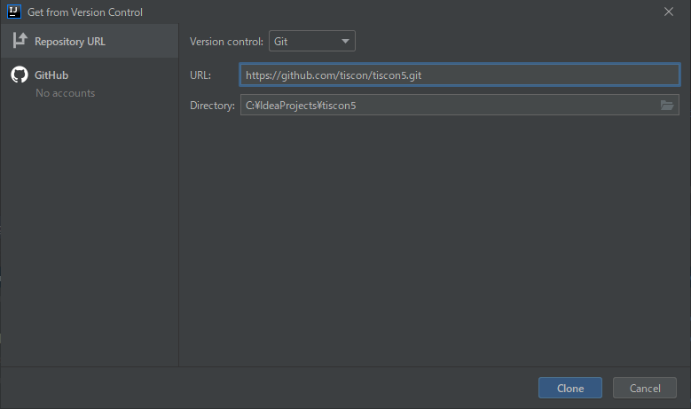
1. Cloneボタンを押下します。
1. 画面下部にステータスが表示されます。バーの表示が消えればcloneは完了です。<br>
下図のような画面が表示された場合、『Yes』を選択してプロジェクトを開いてください。<br>
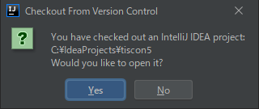

#### プロジェクトを開く

上記clone手順の最後で『No』を選択した場合、手動でプロジェクトを開きます。<br>
clone時にプロジェクトを開いた場合は以下の手順を飛ばしてください。

1. IntellijのWelcome画面からOpen を選択します。<br>
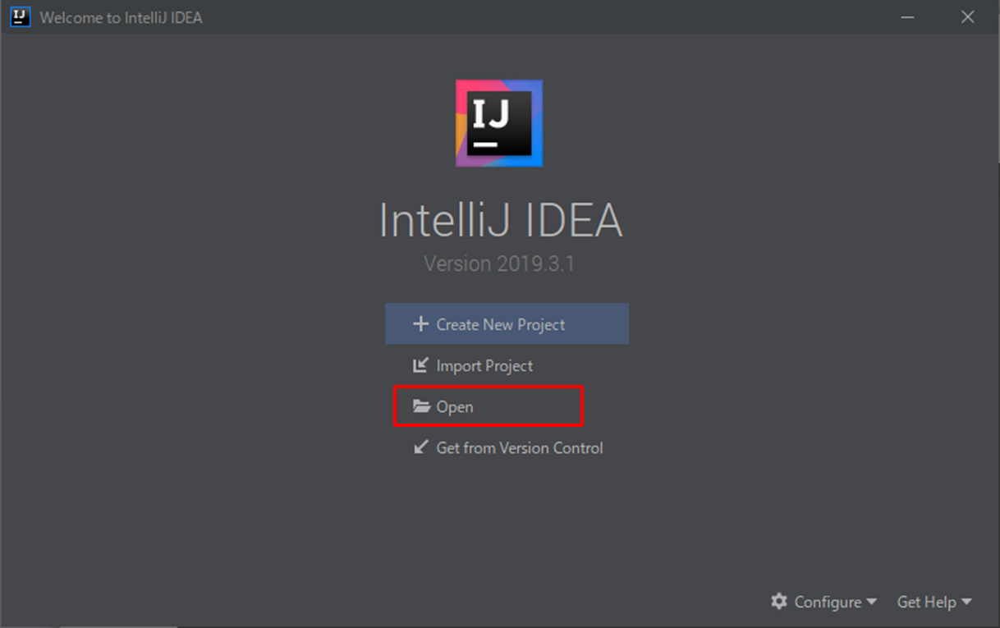

1. `C:\Users\ユーザ名\IdeaProjects\tiscon5` を選択し、OKを押します。<br>
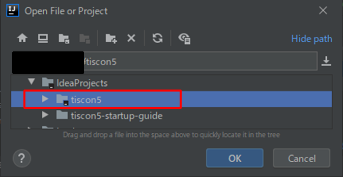

1. tiscon5プロジェクトが開けました。続いてソースコードを確認できるようにします。<br>
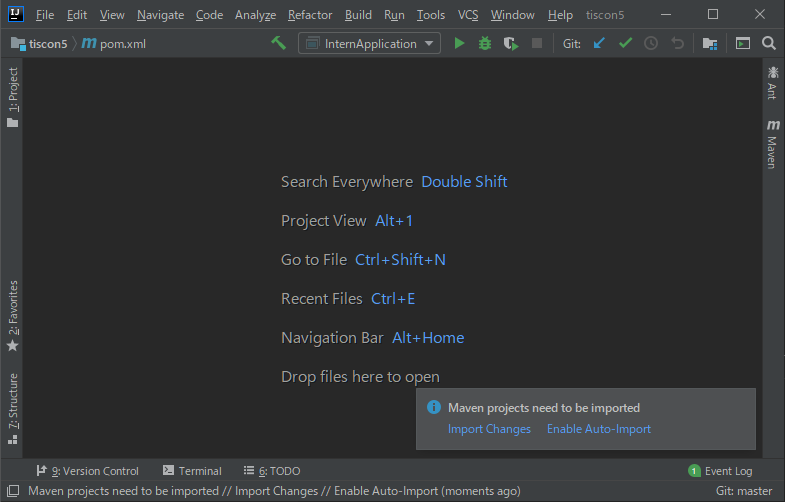

### 2. ソースコード確認

1. IntelliJ上部メニューバーから、`View > Tool Windows > Project` を選択します。<br>
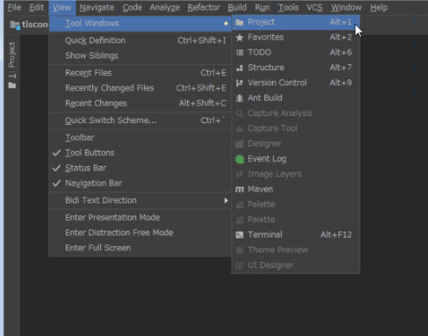

1. Project Viewよりプロジェクト内のソースコードが確認できるようになりました。<br>
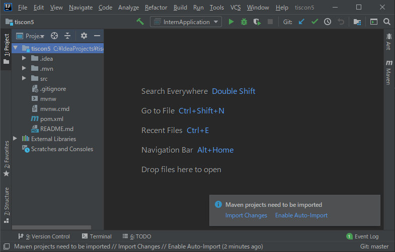

1. 以下のようにpom.xmlに「m」というマークがついていない場合以下の手順を実行してください。  
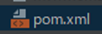

[pom.xml]で右クリックをし、[＋ Add as Maven Project]をクリックしてください。  
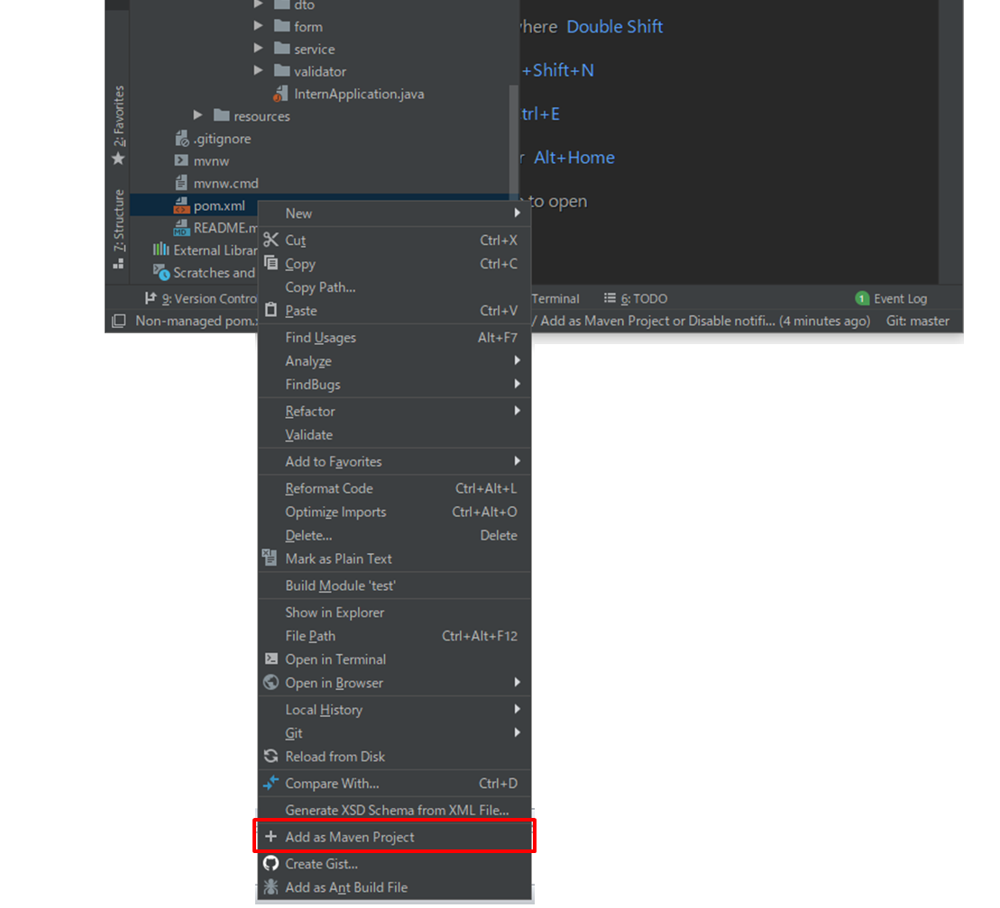

### 3. [Git](https://git-scm.com/)の設定

今後の作業内容をあなたのGitHubアカウントに紐付けられるようにします。

1. IntelliJ上部メニューバーから、`View > Tool Windows > Terminal` を選択します。<br>
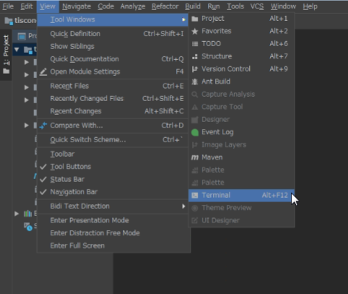

1. Terminal画面が表示されるので、以下を入力してください。<br>
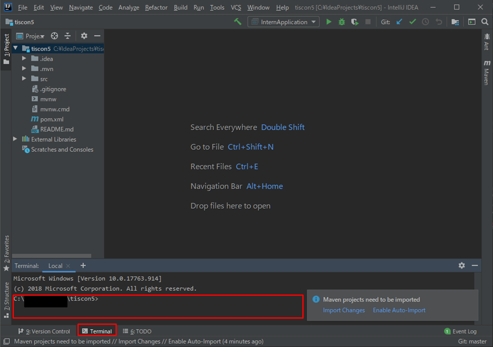
```sh
git config user.name GitHubのユーザ名
git config user.email GitHubのメールアドレス
```
コマンド実行後、何もエラーメッセージが表示されなければ設定完了です。


### 4. Webアプリケーションの起動確認

cloneしたWebアプリケーションが正常に動くか、開発ローカル(自PC)上で動作確認を行います。

##### 1. アプリケーションを起動前に準備する
[Mavenコマンドを実行する](tipsForWin.md#mavenコマンドを実行する)を参考にダイアログを開き、以下のコマンドを実行します。

```text
clean compile
```

##### 2. アプリケーションを起動する
 `src/main/java/com.tiscon/InternApplication` の上で右クリックをし、 `▶ Run 'InternApplicat....main()'`をクリックしてください。

 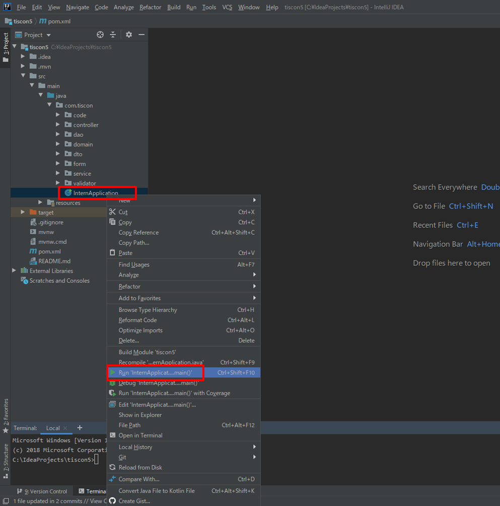

 なお、初回起動時にはWindowsセキュリティの警告がされる場合がありますが、[アクセスを許可する]をクリックしてください。

 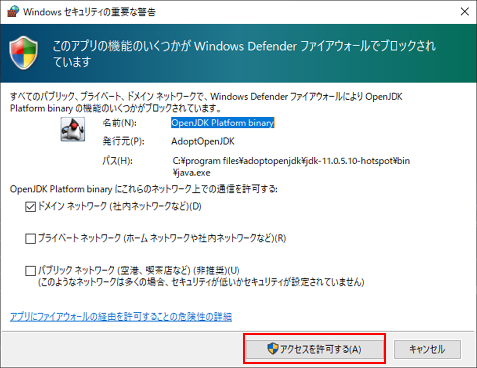

##### 3. ブラウザで画面表示を確認する
以下のURLをクリックし、ブラウザを開いて画面が表示されることを確認します。

http://localhost:9080/

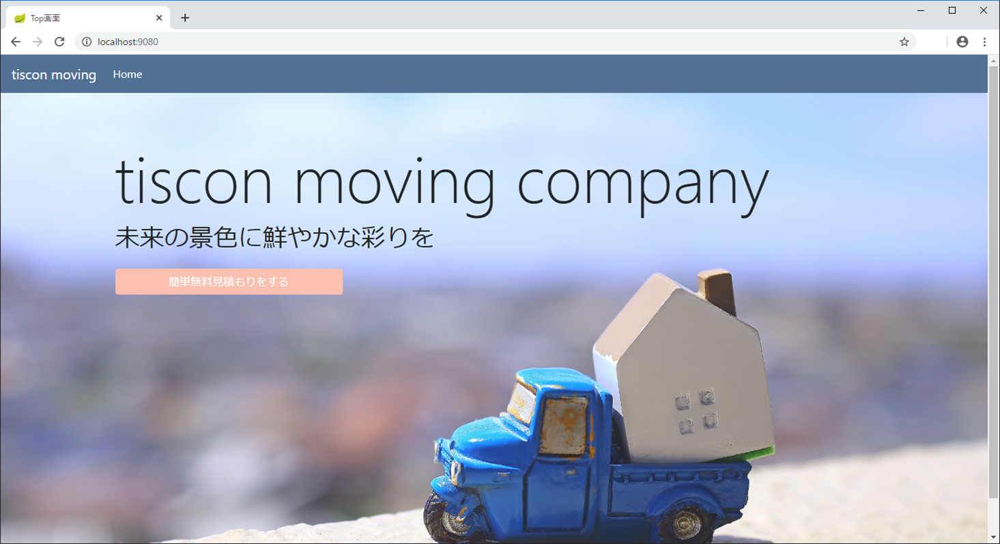

##### 4. アプリケーションを終了する
動作が確認できたらアプリケーションを終了しましょう。<br>
Runの`internApplication`のタブを開いた状態で左の停止ボタンを押します。

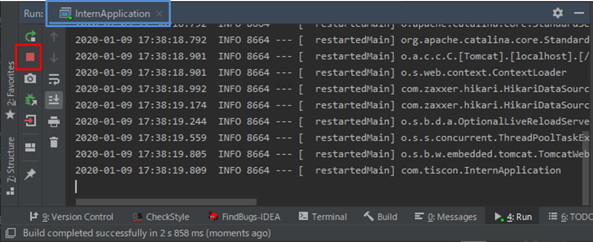

#### お疲れ様でした！
