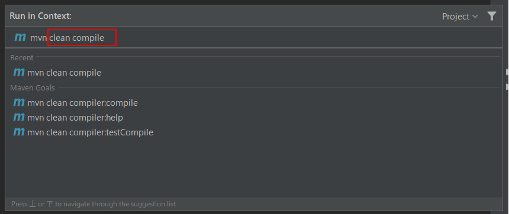

# Windowsマシンの開発TIPS

## コマンドプロンプトの起動方法

コマンドプロンプトとは、いわゆる「黒い画面」です。

環境構築手順において、時々コマンドプロンプトからコマンドを実行する必要があります。
コマンドプロンプトは、以下の手順で起動できます。

* Windows10 をお使いの方 
`スタート` > `Windows システムツール` > `コマンドプロンプト`を選択

* Windows8 をお使いの方 
`スタート画面` > `すべてのアプリ` > `コマンドプロンプト`を選択

環境変数を編集した場合は、コマンドプロンプトを開き直さないと設定が反映されません。
コマンドの実行結果が想定通りでない場合、一度コマンドプロンプトを開き直してみてください。

## 環境変数「Path」の編集

`環境変数の「Path」を編集する場合、もともと記載されている設定は消さないでください！`

設定を消すとPCが動かなくなる場合がありますので、必要な設定の**追記**のみを行ってください。
問題が発生した時に作業前の状態に戻せるよう、環境変数を編集する際は、**編集前の値をテキストファイル等にバックアップ**しておいてください。

## IntelliJ
### Mavenコマンドを実行する
図のように `View > Tool Windows > Maven` を選択します。

    

開いた **Mavenメニュー** よりダイアログを開きます。 

    

    

開いたダイアログに実行したいコマンドを入力します。 
また、この時に元々書かれていた `mvn` は消さないよう注意してください。 
最後にEnterキーを押しコマンドを実行します。

### propertiesファイルを日本語で表示する
下記サイトを参考に、propertiesファイルを日本語で表示してください。
> [IntelliJ IDEAでpropertiesファイルを日本語(各国の言語)で表示する](https://qiita.com/tamura__246/items/7adc91b85abd4d0bb72b)
